# dsh-web-basic

中文 | [English](README.en.md)

**一个 profile，让 dsh web GUI 变得完整。** 发出去的消息可以改、可以撤；长对话一键跳转；agent 写过的文件随手预览；后台任务一目了然；上下文快满时有人提醒——大多数用户最先想要的那层体验，一次装齐。

<!-- 首轮验收后在这里放主图 -->

## 快速开始

```sh
git clone https://github.com/Khorsheed/dsh-web-basic.git
sh dsh-web-basic/scripts/install.sh   # 把 profile 拷进 $DSH_HOME 并安装
sh dsh-web-basic/scripts/restart-into-web-basic.sh   # 当前实例同端口交接给整合包
```

`restart-into-web-basic.sh` 会停掉你当前运行的实例、**在同一个端口**拉起 web-basic——浏览器刷新原地址即可，不用记新端口。想并存对照的话，直接 `dsh --profile web-basic --port 3090` 起在新端口即可。

> **状态**：10 个成员插件已上架 npm（0.1.0）。

<details>
<summary><strong>给 Agent 的安装指南</strong>（用户说"帮我装一下"时，照此执行）</summary>

用户把你叫来说"帮我装一下 https://github.com/Khorsheed/dsh-web-basic"时，按下面三段做，全程不需要浏览器级验证。

**一、安装与离线自检（不碰运行中的实例）**

```sh
git clone https://github.com/Khorsheed/dsh-web-basic.git /tmp/dsh-web-basic
sh /tmp/dsh-web-basic/scripts/install.sh
```

install.sh 末尾会打印组合的行数。如需手动复核：`dsh --profile web-basic --dump-config | grep -c "@khorsheed"` 应为 10(ankh-guard / context-guard / file-preview / message-timeline / message-tools / session-title-edit / taskpilot / ui-file-preview / ui-shortcuts / whalesong)。`dsh` 不在 PATH 时用它的完整路径（可用 `ps` 查当前实例的启动命令获得）。

**二、同端口交接（关键一步）**

```sh
sh /tmp/dsh-web-basic/scripts/restart-into-web-basic.sh [端口，默认 3080]
```

脚本走整合包自带的 ankh-guard 守卫通道：环境探针 → 记录凭证 → 接管当前实例 → watchdog 停旧启新 + canary 验证。**你会随宿主实例一起断开，这是预期**——watchdog 会在原端口拉起 web-basic；脚本刻意不传 `--initiator`，守卫会从你的环境读取 `$DSH_SESSION_ID`，重启报告才能寻址到你的会话：用户重新打开这个会话时，你会收到「重启完成」的 followup 并继续。注意：中断回合的快照续跑依赖旧实例里已挂载 guard（首次交接不具备），从第二次重启起才完整。

两个前置，缺一会被脚本拒绝并给出原因：

- **会话权限**：如果你运行在沙箱会话里（工作区外写入受限），分离的 watchdog 会在回合结束时被回收——脚本会提前拒绝。请用户切到完全权限模式再跑（或直接给用户这条命令让 TA 在终端跑）。
- **不要在沙箱里用 `nohup ... &` 或手写 `kill` + 重启代替**：沙箱按进程树回收，nohup 防不住；手写顺序错了实例永远回不来。

**三、交付**

`curl -s -o /dev/null -w '%{http_code}' http://127.0.0.1:<端口>/` 为 200 后，告诉用户"刷新原页面即可"，并呈上功能清单（即 README「包含什么」一表）：消息编辑/撤回/恢复、历史时间轴、标题内联编辑、产物预览、后台任务胶囊、压缩提醒、自定义快捷键、状态氛围鲸鱼、运维守护。已知边界：纯净 npm 部署里 ankh-guard 的组合 preflight 门禁为降级运行（提示后放行），其余能力完整。

</details>

## 包含什么

| 插件 | 你得到 |
|---|---|
| message-tools | 发出去的消息可以原位编辑、撤回、恢复 |
| message-timeline | 会话左缘一条安静的时间轴——悬停展开，点击跳转 |
| session-title-edit | 聊天头部内联重命名会话 |
| file-preview + ui-file-preview | 「产物」tab：会话写过的每个文件，不开 IDE 直接预览 |
| taskpilot | 后台任务与子 agent 变成聊天框上方的胶囊，一键停止/中断 |
| context-guard | 上下文溢出拒绝请求之前，压缩按钮先出现 |
| ui-shortcuts | Esc 暂停、Ctrl/Cmd+S 插队发送、Ctrl/Cmd+O 新会话，键位可改 |
| whalesong | 任务运行时侧栏鲸鱼喷水；完成时一声提示音 |
| ankh-guard | 运维助手：agent 改完代码想重启时，先验证构建与测试再放行，改坏了自动回滚——装插件、升版本搞挂实例的事它兜着 |

每个成员都是独立插件：整合包只是替你一次装好，任何一个都可以单独卸载或加装（见[按你的方式调整](#按你的方式调整)）。下面逐插件展开，每节附单独安装命令——不想要整合包、只想要某一个插件的话，直接用那一条。

## 功能展示

### message-tools：消息编辑、撤回与恢复

每条用户消息带复制/编辑/撤回操作行。编辑是原位替换，保存后以新消息重新发送；撤回不是打标记——消息及其后内容彻底离开模型上下文，折叠成可展开的分隔线，原文自动回填草稿；还能一键恢复到对话末尾。全程不改动任何官方包。

```sh
dsh plugin --profile web add @khorsheed/dsh-client-message-tools
```

<details>
<summary>展开查看功能示意（5 张）</summary>


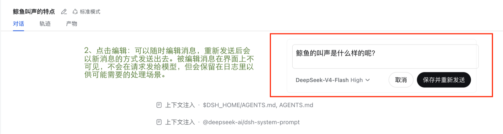

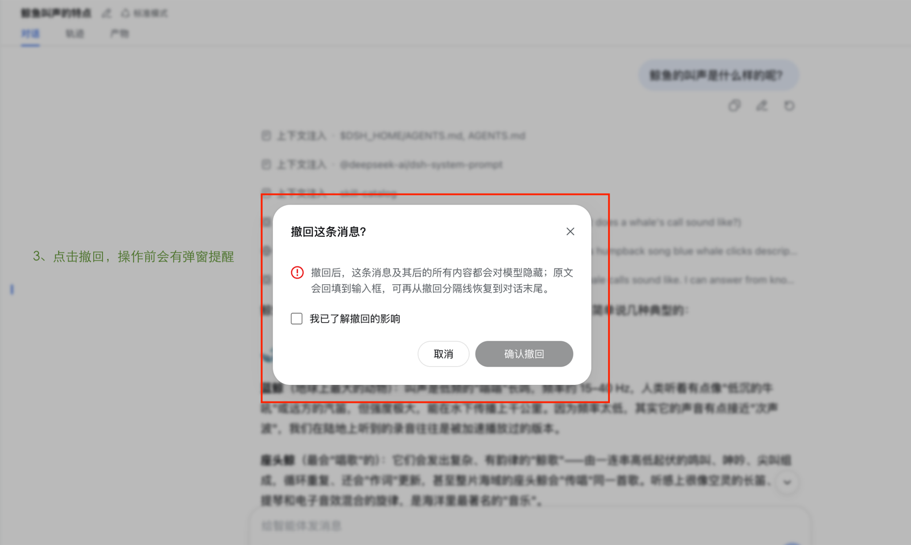

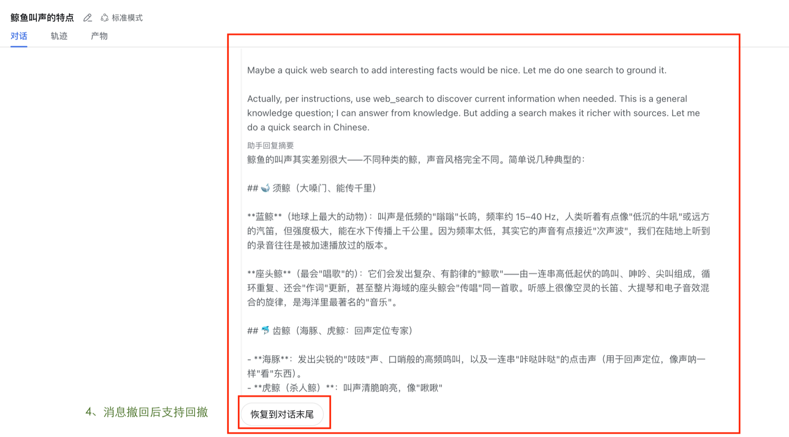

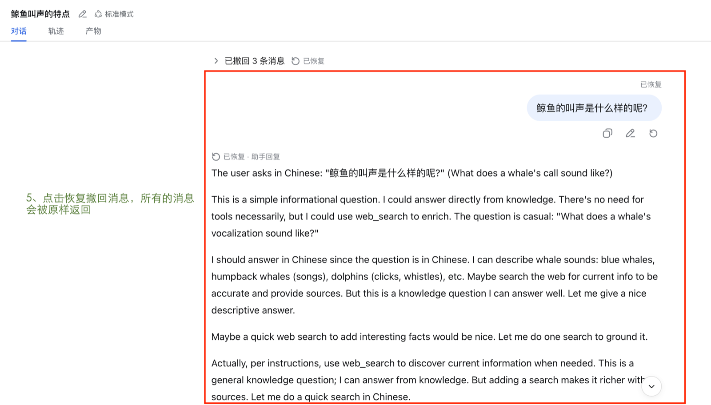

</details>

### message-timeline：历史消息时间轴

会话左缘一条悬浮时间轴，一行一条用户消息。日常收成一条细线不占视线，悬停展开预览，点击直接把会话滚动到对应消息。跟随阅读位置，顶部翻页加载更早历史。纯读取会话快照，对模型零影响。

```sh
dsh plugin --profile web add @khorsheed/dsh-message-timeline
```

<details>
<summary>展开查看功能示意（2 张）</summary>

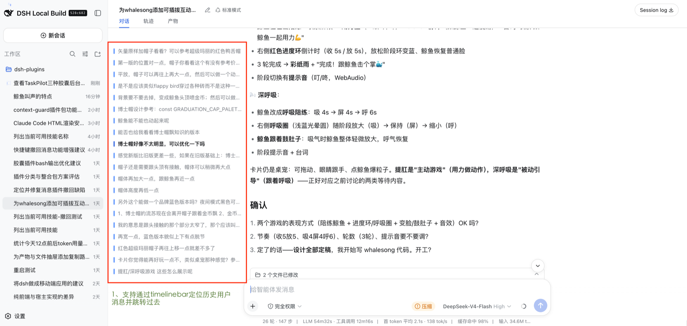

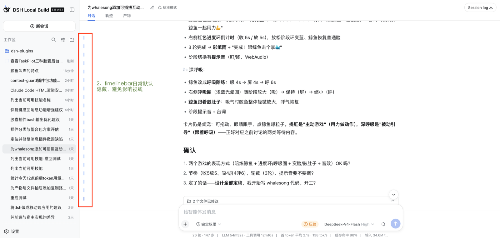

</details>

### session-title-edit：会话标题内联编辑

点击聊天头部标题旁的铅笔，标题本身变成输入框，回车即保存、Escape 取消。用户改过的标题会被钉住，不再被自动生成覆盖。走官方 rename 通道，模型完全无感。

```sh
dsh plugin --profile web add @khorsheed/dsh-client-session-title-edit
```

<details>
<summary>展开查看功能示意（2 张）</summary>

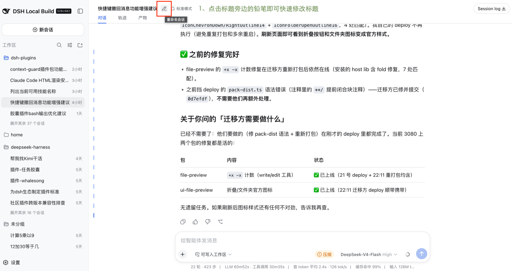

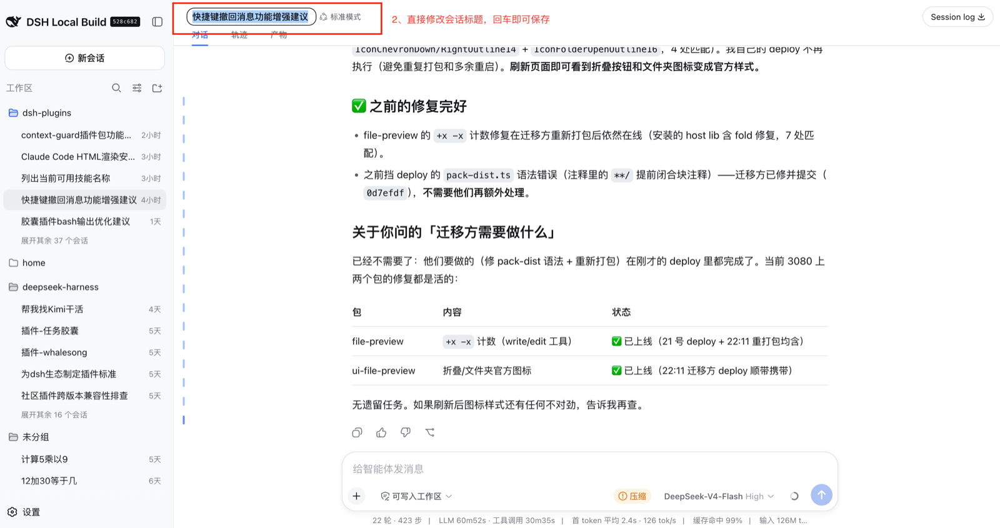

</details>

### file-preview + ui-file-preview：会话产物预览

「产物」tab 列出会话写入/编辑过的每个文件（按最近活动倒序），选中即在页面内预览当前内容；改动记录逐条步进每次 write/edit 的 diff，带内容搜索。宿主服务与浏览器界面成对安装，一条命令两个包：

```sh
dsh plugin --profile web add @khorsheed/dsh-file-preview @khorsheed/dsh-client-ui-file-preview
```

<details>
<summary>展开查看功能示意（3 张）</summary>

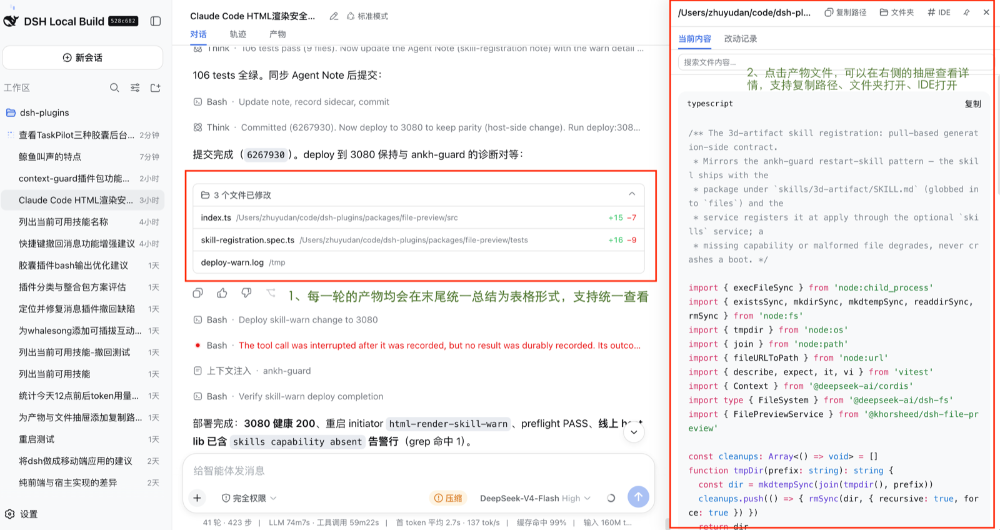

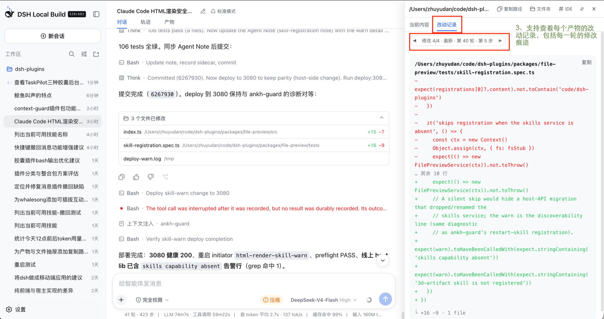

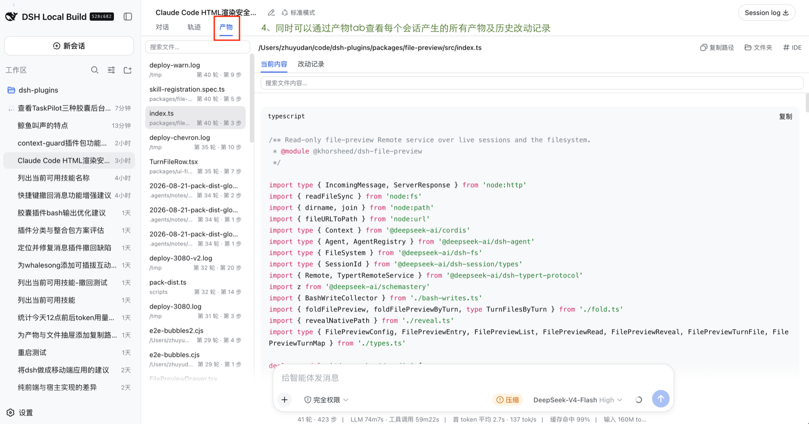

</details>

### taskpilot：后台任务与子 agent 胶囊

聊天框上方两枚胶囊——「后台任务」和「子 agent」——各自独立显隐。运行中的任务每秒计时、带停止按钮；子 agent 展示完整谱系与 token 消耗、可中断；点击行打开详情抽屉，回放执行轨迹。数据全部来自产品已有镜像，对模型零影响。

```sh
dsh plugin --profile web add @khorsheed/dsh-taskpilot
```

<details>
<summary>展开查看功能示意（2 张）</summary>

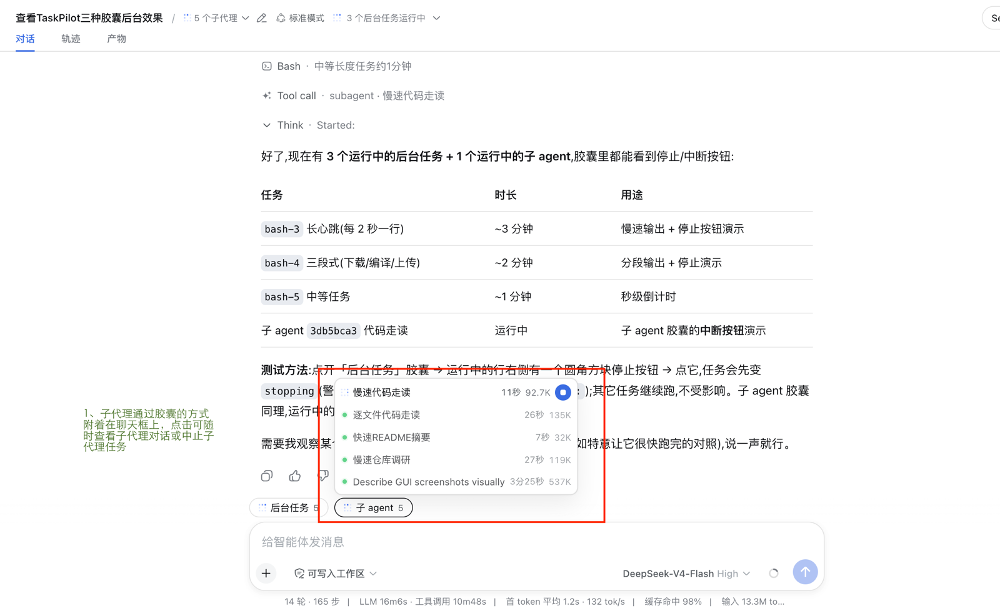

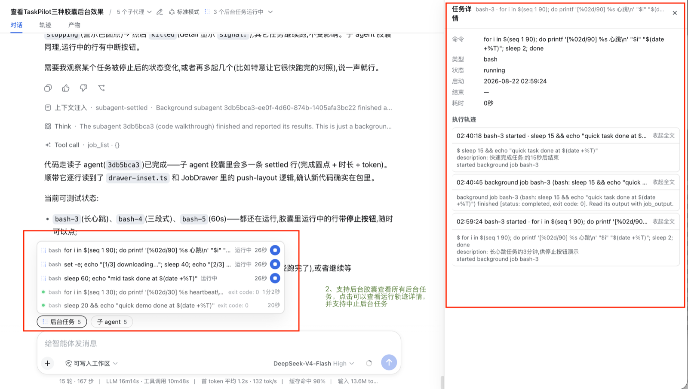

</details>

### context-guard：上下文压缩提醒

上下文占用越过你配置的比例时，输入框工具栏自动出现压缩按钮，点击执行官方 /compact——在溢出拒绝请求之前提醒。提醒比例可在设置里按偏好调整（0.01–1），想早提醒就调低。

```sh
dsh plugin --profile web add @khorsheed/dsh-context-guard
```

<details>
<summary>展开查看功能示意（2 张）</summary>

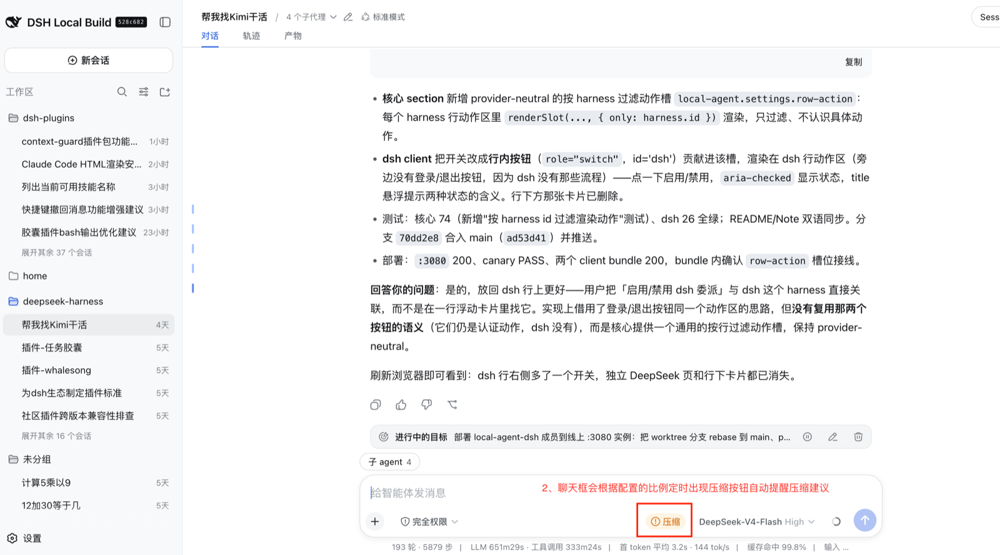

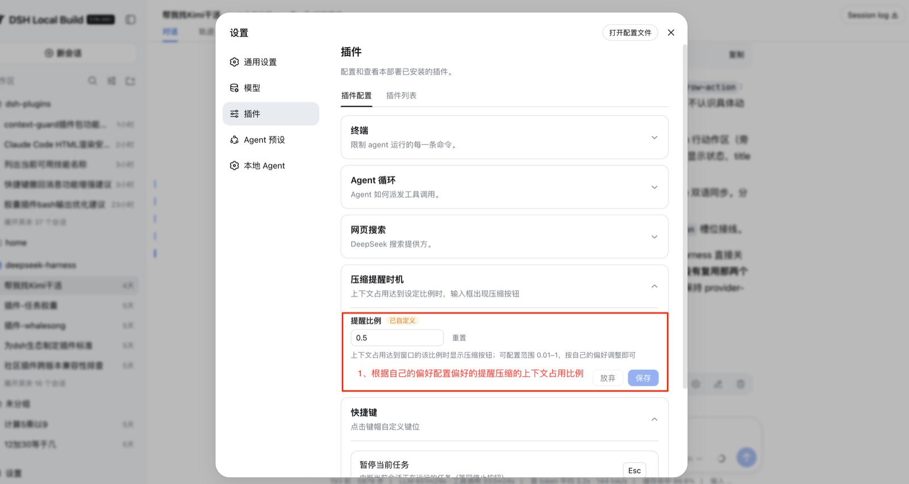

</details>

### ui-shortcuts：可自定义键位的快捷键

Esc 暂停当前任务、Ctrl/Cmd+S 插队发送草稿、Ctrl/Cmd+O 新建会话。设置里点击键帽即可改键，偏好持久保存。还附带一个动作注册表：任何插件都能注册自己的键盘动作，免费获得设置项与无冲突分发。

```sh
dsh plugin --profile web add @khorsheed/dsh-ui-shortcuts
```

<details>
<summary>展开查看功能示意（1 张）</summary>

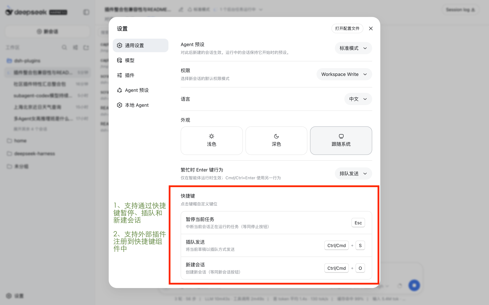

</details>

### whalesong：任务状态氛围

只要有会话在跑，侧边栏的鲸鱼就喷水、标签页图标跟着动；任务完成或卡住等你时，播一小段提示音（WebAudio 合成，`prefers-reduced-motion` 下自动静音）。只读会话列表，对模型零影响——装上，页面就活了。

```sh
dsh plugin --profile web add @khorsheed/dsh-whalesong
```

<details>
<summary>展开查看功能示意（2 张）</summary>

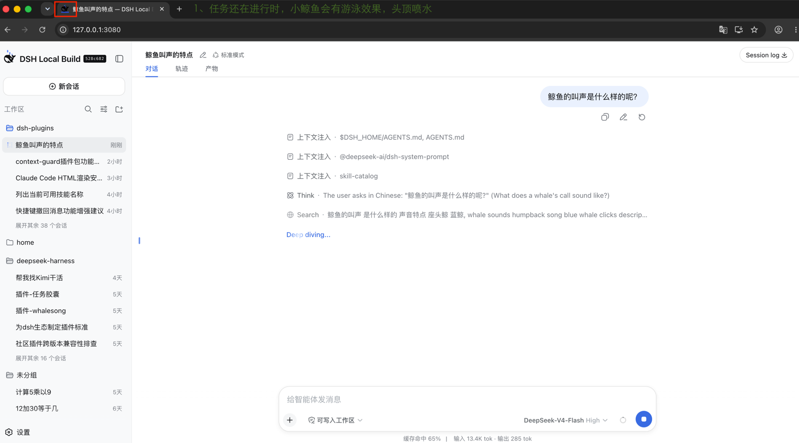

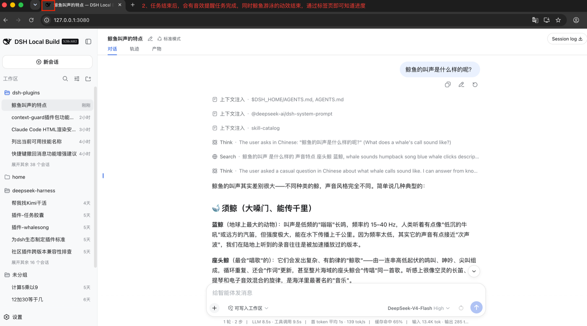

</details>

### ankh-guard：运维守护

让 agent 自己改代码、自己重启，还不把服务搞挂：重启前先验证构建与测试（凭证绑定 git HEAD、限时有效），验证不过就拦下；重启后金丝雀自动激活会话继续验证；连续起不来自动回滚到已知良好版本。自托管、让 AI 自主干活的场景必备。

```sh
dsh plugin --profile web add @khorsheed/dsh-ankh-guard
```

<details>
<summary>展开查看功能示意（1 张）</summary>

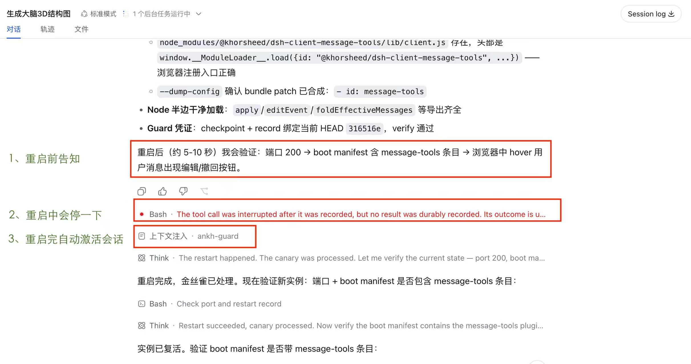

</details>

## 按你的方式调整

- **去掉某个成员**:`dsh plugin --profile web-basic remove @khorsheed/dsh-<名字>`——其余照常工作。整合包是起点，不是绑定
- **加装**:任何 `@khorsheed/dsh-*` 插件同样一条 `add` 命令
- **更新**:`dsh plugin --profile web-basic update` 拉取范围内最新版本

## 变更记录

见 [CHANGELOG.md](CHANGELOG.md)。

## 开发

插件源码在 [Khorsheed/dsh-plugins](https://github.com/Khorsheed/dsh-plugins)（唯一事实源）。本仓只有 profile 模板与文档，不含插件代码。欢迎 issue。
